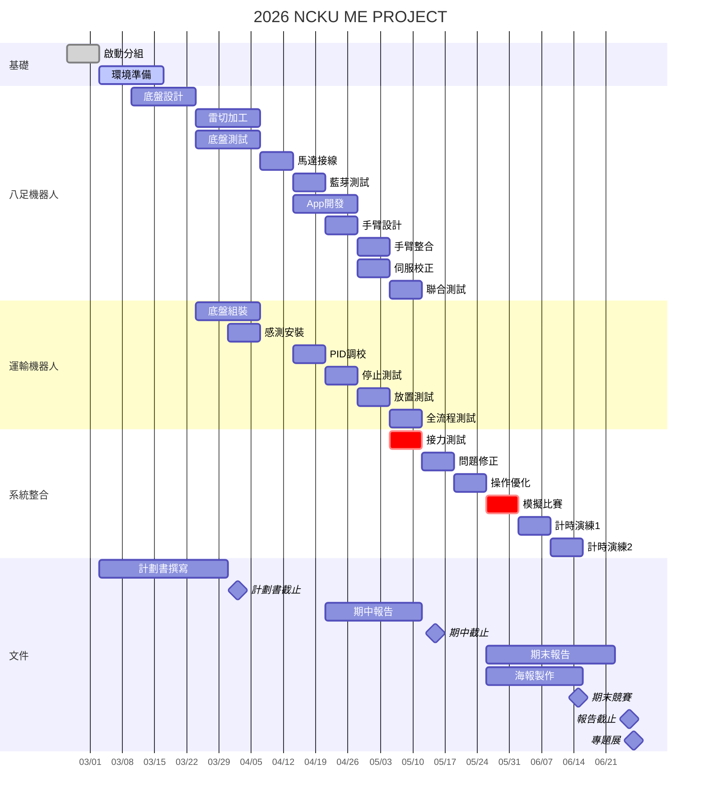

# 2026 NCKU 機械專題實作 — 智慧倉儲物流機器人

> 國立成功大學 機械工程學系 2026 機械專題實作  
> 乙班第2組

## 🚀 快速入門

1. 📖 **[開發步驟指南](開發步驟指南.md)** — 整個專案的分階段開發流程（從環境準備到最終報告）
2. 🤖 **[取物機器人 README](取物機器人(八足Jansen)/README.md)** — 八足 Theo Jansen 子系統總覽
3. 🚚 **[運輸機器人 README](運輸機器人(EV3)/README.md)** — EV3 循跡子系統總覽

## 📋 專案概述

利用機器人系統執行物品取放任務。本組製作兩台機器人：

| 機器人 | 類型 | 操控方式 | 尺寸限制 |
|--------|------|----------|---------|
| **取物機器人** | 八足 Theo Jansen 連桿 | 無線遙控（藍芽） | 長 ≤ 400mm、寬 ≤ 400mm |
| **運輸機器人** | 輪式 EV3 | 全自動循跡 | 長 ≤ 400mm、寬 ≤ **300mm** |

### ⚠ 競賽關鍵規則

- **比賽時間**：每回合 **8 分鐘**
- **三輪競賽**：每次重新抽籤對手，取 **最高分** 為學期競賽成績
- **計分**：零件放入放置區 = 1分/個（最高 48 分）+ 對戰分數 2 分
- **扣分**：掉落零件 -1 分/個、機器人身上殘留零件 -1 分/個
- **重置**：每台機器人 **1 次免費重置**，第 2 次起每次 -1 分
- **區域限制**：取物機器人 **不可進入運輸區**
- **標記**：機器人需標記「**乙-2**」
- **貨架高度**：置物盤底部 156mm、邊框高 200mm（手臂需能伸入）
- **及格分數**：3 分 = 百分比 70 分；前三高分平均 = 100 分

### 🎯 目標物（8 種 × 6 個 = 48 個）

| 零件 | 重量 | 關鍵尺寸 |
|------|------|---------|
| 線性襯套 | 83.3g | 外徑 32mm |
| 大螺帽 | 69.1g | — |
| 六角螺栓 | 56.2g | — |
| 蝶形螺帽 | 30.2g | 有翼 |
| 滾珠軸承 | 28.2g | 外徑 28mm |
| 壓縮彈簧 | 17.5g | 外徑 27mm |
| 小螺帽 | 15.6g | — |
| 拉伸彈簧 | 9.2g | 外徑 16mm |

## 🤖 取物機器人

### 機構設計
- **步行機構**：Theo Jansen Linkage 八足（Spider Robot，交替步態）
- **驅動方式**：左右各 1 顆直流減速馬達，差速轉向
- **夾取機構**：2~3 軸機械手臂 + 二夾爪（平行版 + 海綿 + 止滑墊）
- **整體結構**：分兩層 — 上層夾爪、下層承物台（可傾斜式，一側絞鏈 + 一側伸縮桿）
- **目標**：一次處理兩筆訂單

### 電控系統
- **主控**：Arduino MEGA 2560
- **通訊**：HC-05 藍芽模組 ← 手機 App (App Inventor)
- **馬達驅動**：L298N（步行）、PCA9685 + MG996R 伺服（手臂）
- **供電**：11.1V 鋰電池 + LM2596 降壓板

## 🚚 運輸機器人

### 設計
- **平台**：LEGO EV3 樂高機器人
- **循跡**：雙顏色感測器 PID 循跡（黑色軌跡線）— 第一版 PID 循跡已完成，持續調參
- **停止偵測**：顏色感測器偵測黃色（放置區）/ 紅色（起點）停止線
- **放置機構**：EV3 中馬達驅動，將零件放到放置區平台（高 100mm）
- **計畫中**：運輸帶希望用超音波感測器偵測零件到位

## 📅 甘特圖



- [更多詳細時程安排（含 Google Sheets 版本）請見此](開會紀錄/每週開會主題計畫.md)

## 📁 目錄結構

```
2026-NCKU-ME-PROJECT/
├── README.md                              ← 本文件
├── 開發步驟指南.md                         ← ⭐ 逐步開發流程指南
├── 2026機械專題實作.pdf                    ← 競賽規則
│
├── 取物機器人(八足Jansen)/                  ← 🤖 八足 Theo Jansen 子系統
│   ├── README.md                          ← 子系統總覽
│   ├── BOM.md                             ← 零件清單與預算
│   ├── arduino/
│   │   └── walking_robot.ino              ← Arduino 主程式
│   ├── app_inventor/
│   │   ├── App指令對照表.md                ← 藍芽指令對照
│   │   └── AppInventor開發指南.md          ← App 開發教學
│   ├── 電控/
│   │   └── 接線圖.md                      ← 完整接線參考
│   └── 機構設計/
│       └── TheoJansen連桿設計參考.md       ← 連桿理論與尺寸
│
├── 運輸機器人(EV3)/                        ← 🚚 EV3 循跡子系統
│   ├── README.md                          ← 子系統總覽
│   ├── BOM.md                             ← 零件清單
│   ├── ev3_program/
│   │   └── transport_robot.py             ← EV3 MicroPython 主程式
│   └── 機構設計/
│       └── EV3組裝設計參考.md              ← 組裝要點
│
├── 文件/                                   ← 📄 課程文件與報告
│   ├── Engineering Design Process - 2026_notes.pdf
│   ├── 故障排除指南.md                      ← 🔧 所有問題的集中排查手冊
│   ├── 比賽當天Checklist.md                 ← ✅ 比賽日必備清單
│   ├── 報告/                              ← 報告格式範本
│   │   ├── 專題計畫書格式2026.docx.pdf
│   │   ├── 期中報告格式2026.docx.pdf
│   │   └── 期末報告格式2026.docx.pdf
│   └── 海報/                              ← 海報檔案（待新增）
│
├── 開會紀錄/                               ← 📝 每週開會紀錄
│   ├── TEMPLATE.md                        ← 會議紀錄模板
│   ├── 每週開會主題計畫.md                  ← 📅 14 週議程預排
│   ├── 0224.md
│   └── 0303.md
│
└── 歷屆學長資料(2021屆)/                   ← 📚 2021 屆學長參考資料
    ├── README.md                          ← 學長資料總覽
    ├── 底盤及吸氣馬達_MEGA.ino
    ├── 底盤及吸氣馬達操作app.aia / .apk
    ├── 手臂及伺服馬達_UNO.ino
    ├── 手臂及伺服馬達操作app.aia / .apk
    └── 機專收支Github用.xlsx
```

## 🔧 開發環境

| 工具 | 用途 |
|------|------|
| [Arduino IDE](https://www.arduino.cc/en/software) 或 [VS Code + Arduino 擴充](https://marketplace.visualstudio.com/items?itemName=vsciot-vscode.vscode-arduino) | 取物機器人程式開發 |
| [App Inventor](https://appinventor.mit.edu/) | 遙控 App 開發 |
| [EV3 MicroPython](https://pybricks.com/ev3-micropython/) | 運輸機器人程式開發 |
| SolidWorks / Fusion 360 | 機構 3D 建模 |

## 📊 開發進度（與[開發步驟指南](開發步驟指南.md)同步）

### 階段 0：環境準備與採購
- [ ] 軟體安裝（Arduino IDE 或 VS Code + Arduino 擴充 / App Inventor / VS Code + EV3 / Python）
- [ ] Arduino 函式庫安裝（Adafruit PWM Servo Driver）
- [ ] 零件採購（取物機器人 + 運輸機器人）
- [ ] 學長 `.aia` 檔案已下載並可開啟

### 階段 1：取物機器人 — 底盤機構
- [ ] Python 可視化確認連桿參數
- [ ] SolidWorks 繪製連桿片 + 底盤 2D 圖
- [ ] 雷射切割壓克力
- [ ] 組裝八足底盤 + 手搖測試

### 階段 2：取物機器人 — 電控接線
- [ ] L298N + 直流馬達接線完成
- [ ] HC-05 藍芽連線測試
- [x] Arduino 主程式完成（`walking_robot.ino`）
- [ ] PCA9685 + 伺服馬達接線測試

### 階段 3：取物機器人 — 遙控 App
- [ ] App Inventor 完成遙控 App
- [ ] 步行按鈕（按住/放開）測試通過
- [ ] 手臂按鈕測試通過
- [ ] 匯出 `.apk` 安裝到手機

### 階段 4：取物機器人 — 手臂整合
- [ ] 手臂結構設計 + 加工
- [ ] 安裝到底盤 + 重心確認
- [ ] 伺服角度參數校正
- [ ] 步行 + 手臂同時操作測試

### 階段 5：運輸機器人 — EV3
- [ ] EV3 底盤組裝（馬達 + 感測器）
- [ ] 放置機構組裝
- [x] EV3 主程式完成（`transport_robot.py`）
- [ ] PID 循跡調校
- [ ] 黃色/紅色停止線偵測測試

### 階段 6：雙機聯合測試
- [ ] 模擬場地建立
- [ ] 協同流程演練（取物 → 放置 → 運輸）
- [ ] 計時練習 + 瓶頸優化

### 階段 7：報告與最終調校
- [ ] 計畫書 / 期中 / 期末報告
- [ ] 海報製作
- [ ] **影片製作**（海報+影片合佔成績 5%）
- [ ] 最終參數固定 + 備品準備

## 👥 組員與工作分配

| 姓名 | 負責項目 |
|------|----------|
| 鍾沅駿 | 電控 |
| 陳翊家 | 電控 |
| 李耿泓 | 夾爪 |
| 吳昆哲 | 夾爪 |
| 詹澄汯 | 夾爪 |
| 王子睿 | 底盤 |
| 陳昱辰 | 底盤 |

## 📄 授權

本專案為成功大學機械系課程實作，僅供學術參考用途。
