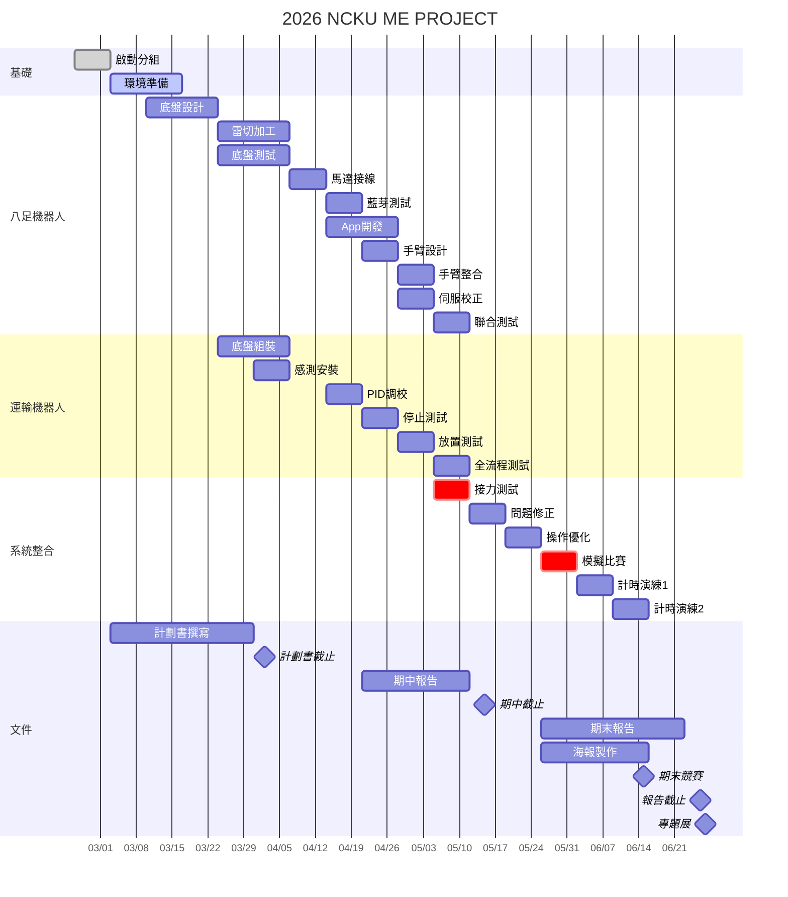

# 2026 NCKU 機械專題實作 — 智慧倉儲物流機器人

> 國立成功大學 機械工程學系 2026 機械專題實作  
> 乙班第2組

## 🚀 快速入門

1. 📖 **[開發步驟指南](開發步驟指南.md)** — 整個專案的分階段開發流程（從環境準備到最終報告）
2. 🤖 **[取物機器人 README](取物機器人(八足Jansen)/README.md)** — 八足 Theo Jansen 子系統總覽
3. 🚚 **[運輸機器人 README](運輸機器人(EV3)/README.md)** — EV3 循跡子系統總覽

## 📋 專案概述

利用機器人系統執行物品取放任務。本組製作兩台機器人：

| 機器人 | 類型 | 操控方式 | 尺寸限制 |
|--------|------|----------|---------|
| **取物機器人** | 八足 Theo Jansen 連桿 | 無線遙控（藍芽） | 長 ≤ 400mm、寬 ≤ 400mm |
| **運輸機器人** | 輪式 EV3 | 全自動循跡 | 長 ≤ 400mm、寬 ≤ **300mm** |

### ⚠ 競賽關鍵規則

- **比賽時間**：每回合 **8 分鐘**
- **三輪競賽**：每次重新抽籤對手，取 **最高分** 為學期競賽成績
- **計分**：零件放入放置區 = 1分/個（最高 48 分）+ 對戰分數 2 分
- **扣分**：掉落零件 -1 分/個、機器人身上殘留零件 -1 分/個
- **重置**：每台機器人 **1 次免費重置**，第 2 次起每次 -1 分
- **區域限制**：取物機器人 **不可進入運輸區**
- **標記**：機器人需標記「**乙-2**」
- **貨架高度**：置物盤底部 156mm、邊框高 200mm（手臂需能伸入）
- **及格分數**：3 分 = 百分比 70 分；前三高分平均 = 100 分

### 🎯 目標物（8 種 × 6 個 = 48 個）

| 零件 | 重量 | 關鍵尺寸 |
|------|------|---------|
| 線性襯套 | 83.3g | 外徑 32mm |
| 大螺帽 | 69.1g | — |
| 六角螺栓 | 56.2g | — |
| 蝶形螺帽 | 30.2g | 有翼 |
| 滾珠軸承 | 28.2g | 外徑 28mm |
| 壓縮彈簧 | 17.5g | 外徑 27mm |
| 小螺帽 | 15.6g | — |
| 拉伸彈簧 | 9.2g | 外徑 16mm |

## 🤖 取物機器人

### 機構設計
- **步行機構**：Theo Jansen Linkage 八足（Spider Robot，交替步態）
- **驅動方式**：左右各 1 顆直流減速馬達，差速轉向
- **夾取機構**：2~3 軸機械手臂 + 二夾爪（平行版 + 海綿 + 止滑墊）
- **整體結構**：分兩層 — 上層夾爪、下層承物台（可傾斜式，一側絞鏈 + 一側伸縮桿）
- **目標**：一次處理兩筆訂單

### 電控系統（分散式架構）
- **主控**：ESP32（主控板）— 負責藍芽遥控接收 + ESP-NOW 指令分發，USB 插電腦供電
- **子控**：ESP32-C3 ×3（#1 腳部 / #2 大圓盤+z / #3 Servo 子控板）
- **通訊**：ESP-NOW（點對點無線通訊）+ ESP32 內建藍芽 ← 手機遥控 App
- **馬達驅動**：BTS7960 (IBT-2) ×4（#1/#2 步行馬達×2、#3 大圓盤、#4 z升降）+ MG996R Servo ×4（r 齒條、θ 旋轉、夾爪開合、承物盒擋板，由 C3 #3 GPIO PWM 直接驅動）
- **供電**：18650 鋰電池 × 4（可擴充至 2~3 組）+ XL4015 降壓模組 5A（Servo 專用 5V）+ LM2596 降壓模組 3A（MCU 專用 5V）

## 🚚 運輸機器人

### 設計
- **平台**：LEGO EV3 樂高機器人
- **循跡**：單顏色感測器 PID 左緣循跡（黑色軌跡線）— 第一版 PID 循跡已完成，持續調參
- **停止偵測**：顏色感測器偵測黃色（放置區）/ 紅色（起點）停止線
- **放置機構**：頂部水平輸送帶（EV3 中馬達驅動），到達放置區後啟動輸送帶將零件推落至平台（高 100mm）
- **近期進度**：依 2026/03/24 會議記錄，現階段重點為 PID 調參與紅黃停止線判定優化

## 📅 甘特圖


```mermaid
gantt
    title 2026 NCKU ME PROJECT
    dateFormat  YYYY-MM-DD
    axisFormat  %m/%d

    %% ===== 基礎 =====
    section 基礎
    啟動分組        :done,   2026-02-24, 7d
    環境準備        :active, 2026-03-03, 14d

    %% ===== 八足 =====
    section 八足機器人
    底盤設計        :2026-03-10, 14d
    雷切加工        :2026-03-24, 14d
    底盤測試        :2026-03-24, 14d
    馬達接線        :2026-04-07, 7d
    藍芽測試        :2026-04-14, 7d
    App開發         :2026-04-14, 14d
    手臂設計        :2026-04-21, 7d
    手臂整合        :2026-04-28, 7d
    伺服校正        :2026-04-28, 7d
    聯合測試        :2026-05-05, 7d

    %% ===== EV3 =====
    section 運輸機器人
    底盤組裝        :2026-03-24, 14d
    感測安裝        :2026-03-31, 7d
    PID調校         :2026-04-14, 7d
    停止測試        :2026-04-21, 7d
    放置測試        :2026-04-28, 7d
    全流程測試      :2026-05-05, 7d

    %% ===== 整合 =====
    section 系統整合
    接力測試        :crit, 2026-05-05, 7d
    問題修正        :2026-05-12, 7d
    操作優化        :2026-05-19, 7d
    模擬比賽        :crit, 2026-05-26, 7d
    計時演練1       :2026-06-02, 7d
    計時演練2       :2026-06-09, 7d

    %% ===== 文件 =====
    section 文件
    計劃書撰寫      :2026-03-03, 28d
    計劃書截止      :milestone, 2026-04-02, 0d
    期中報告        :2026-04-21, 21d
    期中截止        :milestone, 2026-05-15, 0d
    期末報告        :2026-05-26, 28d
    海報製作        :2026-05-26, 21d
    期末競賽        :milestone, 2026-06-15, 0d
    報告截止        :milestone, 2026-06-26, 0d
    專題展          :milestone, 2026-06-27, 0d
```

- [更多詳細時程安排（含 Google Sheets 版本）請見此](開會紀錄/每週開會主題計畫.md)

## 📁 目錄結構

```
2026-NCKU-ME-PROJECT/
├── README.md                              ← 本文件
├── BOM.md                                 ← ⭐ 總零件清單與經費
├── 開發步驟指南.md                         ← ⭐ 逐步開發流程指南
├── 2026機械專題實作.pdf                    ← 競賽規則
│
├── esp32控制/                               ← ⭐ ESP32 分散式控制程式
│   ├── README.md                          ← 控制程式總覽與操作指南
│   ├── protocol.h                         ← 共用通訊協議定義
│   ├── 00_macaddress/                     ← MAC 地址查詢工具
│   ├── 01_MainController/                 ← ESP32 主控板（BLE 版）
│   ├── 02_LegController/                  ← C3 #1 腳部子控板
│   ├── 03_TurntableZController/            ← C3 #2 大圓盤+z 子控板
│   ├── 04_ServoClawController/             ← C3 #3 Servo 子控板
│   └── _test/                          ← 測試用程式
│
├── 取物機器人(八足Jansen)/                  ← 🤖 八足 Theo Jansen 子系統
│   ├── README.md                          ← 子系統總覽
│   ├── BOM.md                             ← 零件清單與預算
│   ├── app_inventor/
│   │   ├── App指令對照表.md                ← 遥控指令對照
│   │   └── AppInventor開發指南.md          ← App 開發教學
│   ├── 電控/
│   │   ├── 接線圖.md                      ← 完整接線參考（含線材規格）
│   │   ├── 電源預算.md                    ← 電流計算、電池續航、線材規格
│   │   └── 電控組裝SOP.md                 ← 分步組裝流程與驗證檢查點
│   └── 機構設計/
│       └── TheoJansen連桿設計參考.md       ← 連桿理論與尺寸
│
├── 運輸機器人(EV3)/                        ← 🚚 EV3 循跡子系統
│   ├── README.md                          ← 子系統總覽
│   ├── BOM.md                             ← 零件清單
│   ├── ev3_program/
│   │   └── transport_robot.py               ← EV3 MicroPython 主程式
│   └── 機構設計/
│       └── EV3組裝設計參考.md              ← 組裝要點
│
├── 文件/                                   ← 📄 課程文件與報告
│   ├── 故障排除指南.md                      ← 🔧 所有問題的集中排查手冊
│   ├── 比賽當天Checklist.md                 ← ✅ 比賽日必備清單
│   ├── 報告/                              ← 報告檔案
│   └── 海報/                              ← 海報檔案（待新增）
│
├── 開會紀錄/                               ← 📝 每週開會紀錄
│   ├── TEMPLATE.md                        ← 會議紀錄模板
│   ├── 每週開會主題計畫.md                  ← 📅 14 週議程預排
│   └── 0224.md ~ 0421.md                   ← 各週會議紀錄
│
└── 歷屆學長資料(2021屆)/                   ← 📚 2021 屆學長參考資料
```

## 🔧 開發環境

| 工具 | 用途 |
|------|------|
| [Arduino IDE](https://www.arduino.cc/en/software) 或 [PlatformIO](https://platformio.org/) | 取物機器人 ESP32 程式開發 |
| ESP32 遙控 App | 遙控 App |
| [EV3 MicroPython](https://pybricks.com/ev3-micropython/) | 運輸機器人程式開發 |
| SolidWorks / Fusion 360 | 機構 3D 建模 |

## 📊 開發進度（與[開發步驟指南](開發步驟指南.md)同步）

### 階段 0：環境準備與採購
- [x] 軟體安裝（Arduino IDE 或 PlatformIO / ESP32 遥控 App / VS Code + EV3 / Python）
- [x] ESP32 開發環境設定（安裝 ESP32 Board 支援）
- [x] 零件採購（取物機器人部分已採購）
- [x] 學長 `.aia` 檔案已下載並可開啟

### 階段 1：取物機器人 — 底盤機構
- [ ] Python 可視化確認連桿參數
- [x] SolidWorks 4 足模擬完成（支撐力 ~3Kg，扭矩 ~0.5 N-m）
- [ ] SolidWorks 繪製連桿片 + 底盤 2D 圖
- [ ] 雷射切割壓克力
- [ ] 組裝八足底盤 + 手搖測試

### 階段 2：取物機器人 — 電控接線
- [ ] BTS7960 ×4 + DC 馬達接線完成
- [x] ESP32 ESP-NOW 三路通訊架構建立
- [x] ESP32 主控板程式完成（01_MainController BLE 版）
- [x] ESP32-C3 #1 腳部子控板程式完成（02_LegController）
- [x] ESP32-C3 #2 大圓盤+z 子控板程式完成（03_TurntableZController）
- [x] ESP32-C3 #3 Servo 子控板程式完成（04_ServoClawController）
- [ ] XL4015 + LM2596 雙降壓模組接線測試

### 階段 3：取物機器人 — 遥控 App
- [ ] ESP32 藍芽遥控 App 完成
- [ ] 步行按鈕（按住/放開）測試通過
- [ ] 手臂按鈕測試通過
- [ ] App 安裝到手機

### 階段 4：取物機器人 — 手臂整合
- [x] 夾爪設計完成
- [ ] 手臂結構設計 + 加工
- [ ] 安裝到底盤 + 重心確認
- [ ] 伺服角度參數校正
- [ ] 步行 + 手臂同時操作測試

### 階段 5：運輸機器人 — EV3
- [ ] EV3 底盤組裝（馬達 + 感測器）
- [ ] 放置機構組裝
- [x] EV3 主程式完成（`transport_robot.py`）
- [x] PID 循跡初步實現
- [x] 停止線辨識功能完成
- [x] 物品偵測啟動
- [x] 安全保護機制建立
- [ ] PID 循跡調校（持續調參）
- [ ] 黃色/紅色停止線偵測測試

### 🎯 期中前目標（截至 W12, ~5/12）

| 子系統 | 目標 |
|---------|------|
| **EV3** | 輸送帶完成、PID 設定、裝載盒設計 |
| **夾爪** | 組裝、抓力調適、乘載盒製作 |
| **腿部** | Ansys 模擬、齒輪配比、組裝 |
| **電控** | 馬達驅動、夾爪控制雛形、電源走線管理 |

### 階段 6：雙機聯合測試
- [ ] 模擬場地建立
- [ ] 協同流程演練（取物 → 放置 → 運輸）
- [ ] 計時練習 + 瓶頸優化

### 階段 7：報告與最終調校
- [ ] 計畫書 / 期中 / 期末報告
- [ ] 海報製作
- [ ] **影片製作**（海報+影片合佔成績 5%）
- [ ] 最終參數固定 + 備品準備

## 👥 組員與工作分配

| 姓名 | 學號 | 負責項目 |
|------|------|----------|
| 詹澄汯 | E14126511 | 承物台設計（絞鏈+伸縮桿）、夾爪、組裝調整、乘載盒製作 |
| 鍾沅駿 | E14121040 | ESP32 程式開發、ESP-NOW 通訊、EV3 軟體 |
| 吳昆哲 | E14126529 | 手臂滑軌設計、SolidWorks 建模、限位開關 |
| 李耿泓 | E14122216 | 夾爪設計（齒輪齒條）、3D 列印、齒輪配合、抓力調適 |
| 王子睿 | E14139043 | 八足 Theo Jansen 連桿設計、壓克力雷切、Ansys 模擬 |
| 陳翊家 | E14102119 | 腿部子控板 ESP32-C3 程式、電源走線管理、腿部機構、電控、BTS7960 接線、ESP-NOW 通訊 |
| 陳昱辰 | E14122208 | EV3 底盤組裝、輸送帶機構、裝載盒設計 |

## 📄 授權

本專案為成功大學機械系課程實作，僅供學術參考用途。
