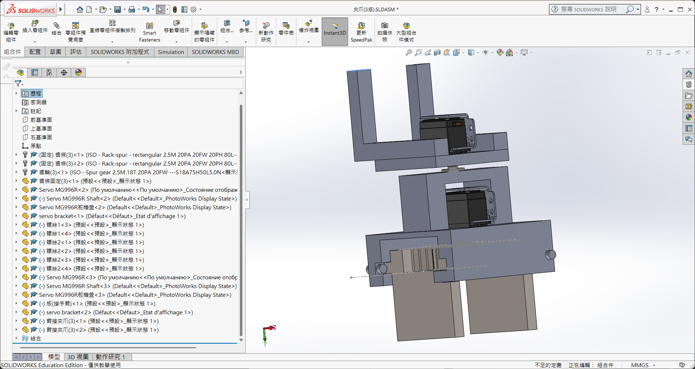
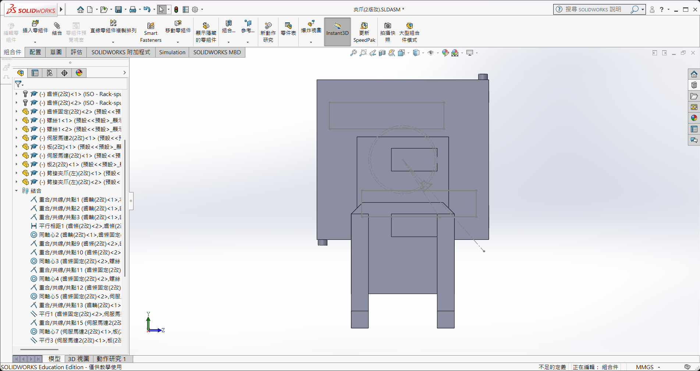
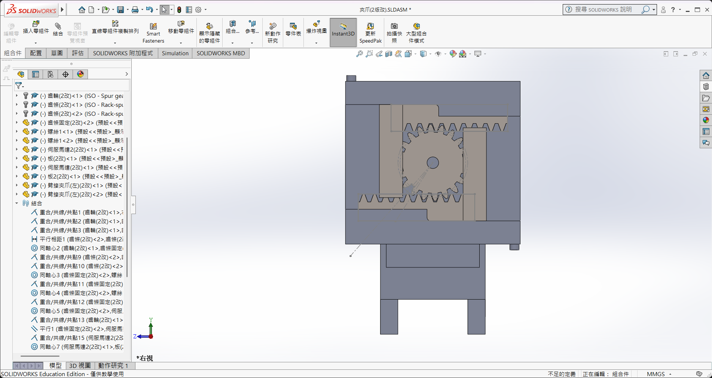
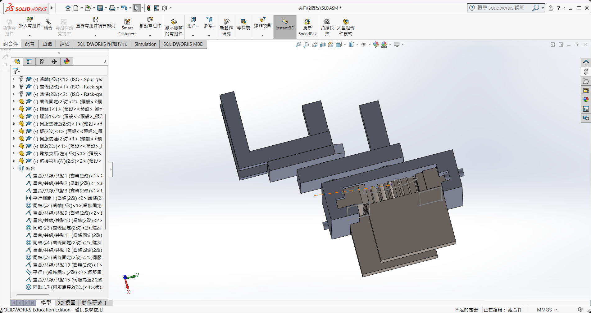

# 取物機器人（八足 Theo Jansen）

> 本目錄包含八足 Theo Jansen 連桿取物機器人的全部資料。

## 系統架構

```
手機 App (App Inventor)
    │  藍芽 (HC-05, 38400 baud)
    ▼
Arduino MEGA 2560
    ├── L298N (板A) → 直流減速馬達 ×2（左右側八足步行）
    ├── L298N (板B) → 直流減速馬達 ×2（手臂滑軌伸縮、夾爪齒條開合）
    ├── 限位開關 (Limit Switch) → 夾爪極限安全斷電保護
    └── PCA9685 (I2C) → (舊版備用) 伺服馬達群
```

## 步行機構

- **類型**：Theo Jansen Linkage 八足（Spider Robot）
- **步態**：交替步態（Alternating Gait）— 同側每足相位差 90°，左右側錯開 180°
- **驅動**：左右各 1 顆直流減速馬達，差速轉向
- **連桿參數**：Theo Jansen 11 Holy Numbers（縮放因子 0.7）

詳細連桿設計請見 → [TheoJansen連桿設計參考.md](機構設計/TheoJansen連桿設計參考.md)

## 八足配置

```
  俯視圖（↑ = 前進方向）

       前
  足1 ── 足5
   |      |
  足2 ── 足6     ← 機身
   |      |
  足3 ── 足7
   |      |
  足4 ── 足8
       後

  左側（足1~4）→ 馬達 A
  右側（足5~8）→ 馬達 B
```

## 夾取機構

## 夾取機構 (Rack and Pinion)

- **夾爪類型**：齒輪齒條雙向平行夾爪 (Rack and Pinion) — 平行版 + 止滑墊
- **設計參考**：
  - 
  - 
  - 
  - 
- **機構設計**：
  - **夾爪本體**：使用 3D 列印製作夾爪板與溝槽板，齒輪採用壓克力雷射切割，齒條另外採購。
  - **手臂驅動**：採用**線性滑軌**結構，手臂整條由馬達帶動進行伸縮控制。
- **驅動設計**：
  - **手臂與夾爪動力**：改用 **XD-25GA 370 直流減速馬達 (12V, 50 RPM)** 提供高扭力。
  - **控制方式**：由額外的 L298N 驅動板控制正反轉。
  - **安全保護機制**：因 DC 馬達無角度回傳，機構上需加裝 **微動開關 (Limit Switch)**。在夾爪「全開」與「全關（最小物品）」極限處安裝，觸發時 Arduino 即時斷電，防止馬達卡死燒毀或崩齒；軟體輔以 Maximum Timeout（最大通電時間）作為保護。
- 由於 370 減速箱具有自鎖效應，夾取物品後斷電仍可保持夾緊力，相較伺服馬達更為省電。
- **貨架高度限制**：置物盤底部 156mm、邊框高 200mm → 手臂需伸入此高度。
- **夾取物限制**：最重零件為線性襯套 83.3g、最大外徑 32mm → 夾爪開口需大於 32mm，且馬達扭力需能支撐。

## 整體結構

- **分兩層設計**：
  - 上層：夾爪 + 機械手臂
  - 下層：承物台（堆高機）— 用於暫存取下的零件
- **承物台**：可傾斜式（一側絞鏈、一側伸縮桿），方便將零件倒入運輸機器人
- **目標**：希望一次處理兩筆訂單（取多個零件後一次傾倒）

## 目錄結構

```
取物機器人(八足Jansen)/
├── README.md              ← 本文件
├── BOM.md                 ← 零件清單與預算
├── arduino/
│   └── walking_robot.ino  ← Arduino 主程式
├── app_inventor/
│   ├── App指令對照表.md    ← 藍芽指令對照
│   └── AppInventor開發指南.md ← App 開發教學
├── 電控/
│   └── 接線圖.md          ← 完整接線參考
└── 機構設計/
    └── TheoJansen連桿設計參考.md  ← 連桿理論與尺寸
```

## 快速開始

1. 閱讀 [BOM.md](BOM.md) 確認零件
2. 閱讀 [電控/接線圖.md](電控/接線圖.md) 完成接線
3. 用 VS Code（或 Arduino IDE）上傳 [walking_robot.ino](arduino/walking_robot.ino)
4. 用 App Inventor 建立遙控 App（見 [AppInventor開發指南.md](app_inventor/AppInventor開發指南.md)）
5. 測試藍芽控制步行和手臂

## 藍芽指令速查

| 指令 | 功能 | 指令 | 功能 |
|------|------|------|------|
| `f` | 前進 | `u` | 肩上升 |
| `b` | 後退 | `d` | 肩下降 |
| `l` | 左轉 | `i` | 肘上升 |
| `r` | 右轉 | `k` | 肘下降 |
| `q` | 左旋轉 | `o` | 爪張開 |
| `e` | 右旋轉 | `p` | 爪閉合 |
| `0` | 停止 | `h` | 手臂歸位 |
|     |       | `t` | 承物台傾斜 |
|     |       | `y` | 承物台水平 |

大寫 `F/B/L/R` = 半速版本。
