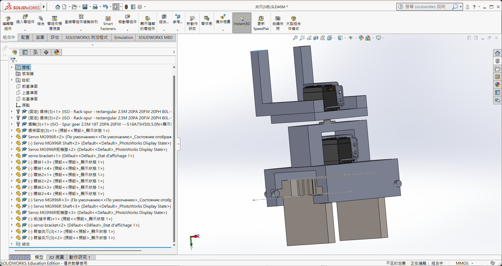
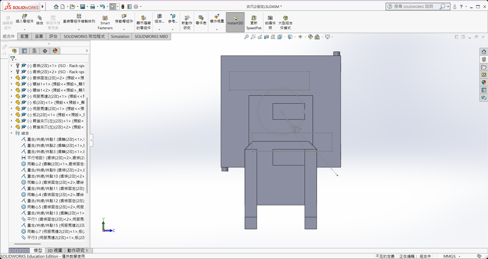
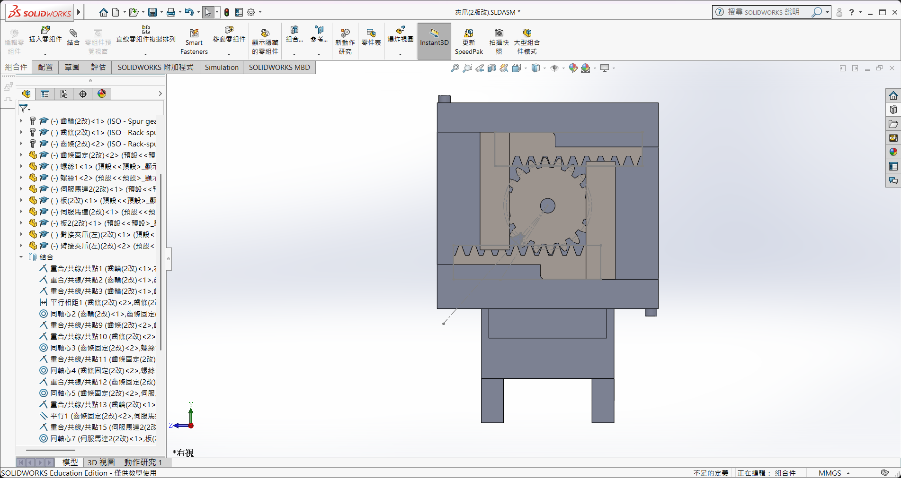
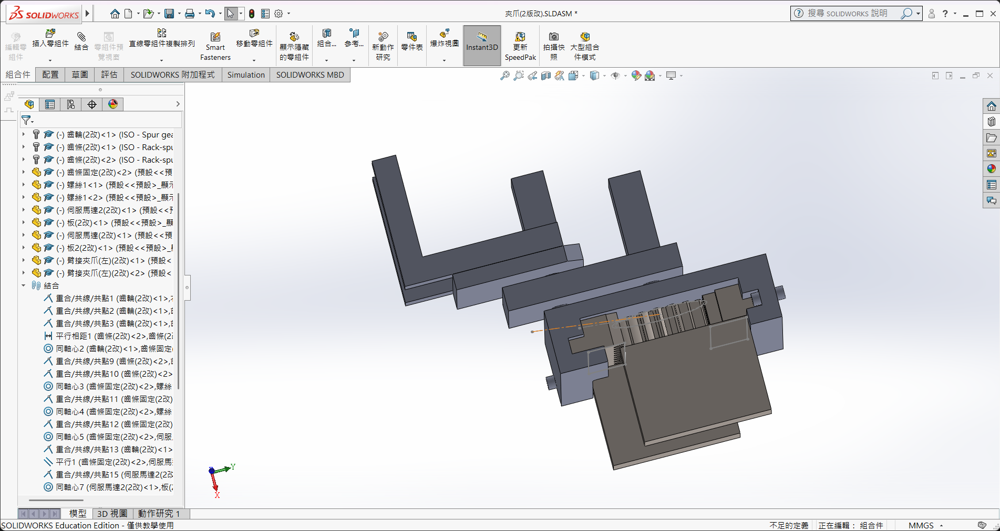

# 取物機器人（八足 Theo Jansen）

> 本目錄包含八足 Theo Jansen 連桿取物機器人的全部資料。

## 系統架構

```
手機遙控 App（ESP32 內建藍芽）
    │
    ▼
ESP32（主控板）── 藍芽接收 + ESP-NOW 指令分發中心
    │
    ├── ESP-NOW ──→ ESP32-C3 #1（腿部子控板）
    │                 └── L298N (板A) → JGB37-520 直流減速馬達 ×2
    │                                   （左右側八足步行）
    │
    ├── ESP-NOW ──→ ESP32-C3 #2（手臂 r/θ 子控板）
    │                 ├── L298N (板B) → XD-25GA 370 手臂馬達 ×2
    │                 │                 （r 手臂伸縮 + θ 手臂旋轉）
    │                 └── 限位開關 (Limit Switch) → 極限安全斷電保護
    │
    └── ESP-NOW ──→ ESP32-C3 #3（z/夾爪 子控板）
                      ├── L298N (板C) → z 方向升降馬達
                      ├── 伺服馬達 (GPIO PWM) → 夾爪開合
                      ├── 伺服馬達 (GPIO PWM) → 承物台傾斜
                      └── 限位開關 → z 極限保護

    電源：18650 鋰電池 × 4（四節電池盒）
    └── LM2596 降壓模組 → 5V 供 ESP32 + ESP32-C3 + 伺服馬達
```

透過 ESP-NOW 讓各個 ESP 控制板之間不需 Wi-Fi 即可做點對點通訊，在功能上設計模組化的系統。  
**主控板不直接驅動任何馬達**，僅負責藍芽指令接收與 ESP-NOW 指令分發。

## 步行機構

- **類型**：Theo Jansen Linkage 八足（Spider Robot）
- **步態**：交替步態（Alternating Gait）— 同側每足相位差 90°，左右側錯開 180°
- **驅動**：左右各 1 顆直流減速馬達，差速轉向
- **控制**：由 ESP32-C3 #1（腿部子控板）透過 L298N 驅動
- **連桿參數**：Theo Jansen 11 Holy Numbers（縮放因子 0.7）

詳細連桿設計請見 → [TheoJansen連桿設計參考.md](機構設計/TheoJansen連桿設計參考.md)

## 八足配置

```
  俯視圖（↑ = 前進方向）

       前
  足1 ── 足5
   |      |
  足2 ── 足6     ← 機身
   |      |
  足3 ── 足7
   |      |
  足4 ── 足8
       後

  左側（足1~4）→ 馬達 A  ┐
  右側（足5~8）→ 馬達 B  ┘ 由 ESP32-C3 #1 控制
```

## 夾取機構 (Rack and Pinion)

### 設計概念

- **座標系統**：採用圓柱座標系取代卡氏座標系，降低設計複雜度同時保留足夠的自由度
- **傳動方式**：齒輪、齒條與馬達控制
- **設計目標**：重量減輕，採用角度夾爪

這些特點使夾爪在設計上複雜度降低，但同時保留足夠的自由度來完成夾取動作。

### 機構規格

- **夾爪類型**：齒輪齒條雙向平行夾爪 (Rack and Pinion) — 平行版 + 止滑墊
- **設計參考**：
  - 
  - 
  - 
  - 
- **機構設計**：
  - **夾爪本體**：使用 3D 列印製作夾爪板與溝槽板，齒輪採用壓克力雷射切割，齒條另外採購。
  - **手臂驅動**：採用**線性滑軌**結構，手臂整條由馬達帶動進行伸縮控制。
- **驅動設計**：
  - **手臂 r/θ 動力**（ESP32-C3 #2）：使用 **XD-25GA 370 直流減速馬達 (12V, 50 RPM)** 提供高扭力，由 L298N 控制正反轉。
  - **z 方向升降**（ESP32-C3 #3）：使用直流減速馬達 + L298N。
  - **夾爪開合**（ESP32-C3 #3）：使用**伺服馬達**，由 C3 GPIO 直接 PWM 驅動。
  - **安全保護機制**：因 DC 馬達無角度回傳，機構上需加裝 **微動開關 (Limit Switch)**。在夾爪「全開」與「全關（最小物品）」極限處安裝，觸發時 ESP32-C3 即時斷電，防止馬達卡死燒毀或崩齒；軟體輔以 Maximum Timeout（最大通電時間）作為保護。
- 由於 370 減速箱具有自鎖效應，夾取物品後斷電仍可保持夾緊力，相較伺服馬達更為省電。
- **貨架高度限制**：置物盤底部 156mm、邊框高 200mm → 手臂需伸入此高度。
- **夾取物限制**：最重零件為線性襯套 83.3g、最大外徑 32mm → 夾爪開口需大於 32mm，且馬達扭力需能支撐。

## 整體結構

- **分兩層設計**：
  - 上層：夾爪 + 機械手臂
  - 下層：承物台（堆高機）— 用於暫存取下的零件
- **承物台**：可傾斜式（一側絞鏈、一側伸縮桿），由 ESP32-C3 #3 的伺服馬達控制
- **目標**：希望一次處理兩筆訂單（取多個零件後一次傾倒）

## 目錄結構

```
取物機器人(八足Jansen)/
├── README.md              ← 本文件
├── BOM.md                 ← 零件清單與預算
├── arduino/
│   └── walking_robot.ino  ← ESP32 主程式（Arduino 框架）
├── app_inventor/
│   ├── App指令對照表.md    ← 藍芽指令對照
│   └── AppInventor開發指南.md ← App 開發教學
├── 電控/
│   └── 接線圖.md          ← 完整接線參考
└── 機構設計/
    └── TheoJansen連桿設計參考.md  ← 連桿理論與尺寸
```

## 快速開始

1. 閱讀 [BOM.md](BOM.md) 確認零件
2. 閱讀 [電控/接線圖.md](電控/接線圖.md) 完成接線
3. 閱讀 [esp32控制/README.md](../esp32控制/README.md) 了解程式架構與上傳流程
4. 上傳 ESP32 主控程式（`MainController` 或 `MainController_BLE`）
5. 上傳 ESP32-C3 子控板程式（`LegController` / `noah_夾爪控制測試` / `ZClawController`）
6. 設定 ESP32 藍芽遙控 App（參考 [App指令對照表](app_inventor/App指令對照表.md)）
7. 測試 ESP-NOW 三路通訊與步行、手臂、夾爪控制

## 藍芽指令速查

### 腿部指令（→ C3 #1）

| 指令 | 功能 | 指令 | 功能 |
|------|------|------|------|
| `f` | 前進 | `F` | 半速前進 |
| `b` | 後退 | `B` | 半速後退 |
| `l` | 左轉 | `L` | 半速左轉 |
| `r` | 右轉 | `R` | 半速右轉 |
| `q` | 左旋轉 | `e` | 右旋轉 |
| `0` | 全部停止 | | |

### 手臂 r/θ 指令（→ C3 #2）

| 指令 | 功能 |
|------|------|
| `w` | 手臂伸出 (r+) |
| `s` | 手臂縮回 (r-) |
| `a` | 手臂左轉 (θ-) |
| `d` | 手臂右轉 (θ+) |

### z/夾爪指令（→ C3 #3）

| 指令 | 功能 | 指令 | 功能 |
|------|------|------|------|
| `u` | z 上升 | `j` | z 下降 |
| `o` | 夾爪張開 | `p` | 夾爪閉合 |
| `t` | 蓋板開（承物台傾斜） | `y` | 蓋板關（承物台水平） |
| `h` | 歸位（z 下降到底 + 夾爪張開 + 蓋板關） | | |

> 詳細指令協議請見 → [esp32控制/README.md](../esp32控制/README.md)
