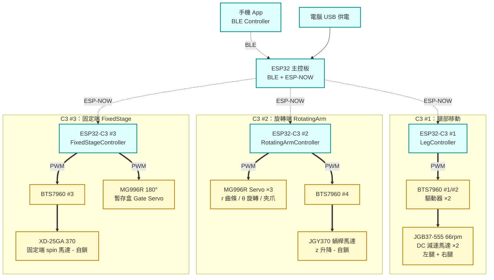

```mermaid
graph TD
    %% ================= 樣式設定 =================
    classDef mcu fill:#e0ffff,stroke:#008b8b,stroke-width:2px;
    classDef motor fill:#fffacd,stroke:#b8860b,stroke-width:2px;

    %% ================= 主控系統（獨立節點） =================
    APP["手機 App<br>BLE Controller"] -.->|BLE| ESP32_M["ESP32 主控板<br>BLE + ESP-NOW"]
    PC["電腦 USB 供電"] --> ESP32_M

    %% ================= 子控板 1：腿部 =================
    subgraph Slave1 ["C3 #1：腿部移動"]
        C3_1["ESP32-C3 #1<br>LegController"] ==>|PWM| BTS_1["BTS7960 #1/#2<br>驅動器 ×2"]
        BTS_1 ==> M_LEG["JGB37-555 66rpm<br>DC 減速馬達 ×2<br>左腿 + 右腿"]
    end

    %% ================= 子控板 2：旋轉端 =================
    subgraph Slave2 ["C3 #2：旋轉端 RotatingArm"]
        C3_2["ESP32-C3 #2<br>RotatingArmController"] ==>|PWM| SRV_ARM["MG996R Servo ×3<br>r 齒條 / θ 旋轉 / 夾爪"]
        C3_2 ==>|PWM| BTS_4["BTS7960 #4"]
        BTS_4 ==> M_Z["JGY370 蝸桿馬達<br>z 升降 - 自鎖"]
    end

    %% ================= 子控板 3：固定端 =================
    subgraph Slave3 ["C3 #3：固定端 FixedStage"]
        C3_3["ESP32-C3 #3<br>FixedStageController"] ==>|PWM| BTS_3["BTS7960 #3"]
        BTS_3 ==> M_SPIN["XD-25GA 370<br>固定端 spin 馬達 - 自鎖"]
        C3_3 ==>|PWM| SRV_GATE["MG996R 180°<br>暫存盒 Gate Servo"]
    end

    %% ================= ESP-NOW 無線通訊 =================
    ESP32_M -.->|ESP-NOW| C3_1
    ESP32_M -.->|ESP-NOW| C3_2
    ESP32_M -.->|ESP-NOW| C3_3

    %% ================= 套用樣式 =================
    class APP,ESP32_M,PC,C3_1,C3_2,C3_3 mcu;
    class M_LEG,M_Z,M_SPIN,SRV_ARM,SRV_GATE,BTS_1,BTS_4,BTS_3 motor;
```
