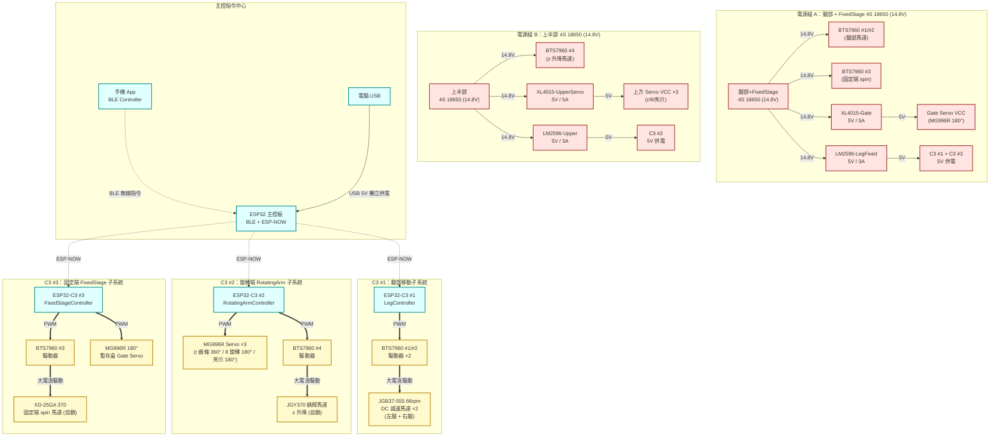

```mermaid
graph TD
    %% ================= 樣式設定 =================
    classDef power fill:#ffe4e1,stroke:#a52a2a,stroke-width:2px;
    classDef mcu fill:#e0ffff,stroke:#008b8b,stroke-width:2px;
    classDef motor fill:#fffacd,stroke:#b8860b,stroke-width:2px;

    %% ================= 電源系統 — 腿部 + FixedStage =================
    subgraph PowerLeg ["電源組 A：腿部 + FixedStage 4S 18650 (14.8V)"]
        BATT_LF["腿部+FixedStage<br>4S 18650 (14.8V)"]
        BATT_LF -->|14.8V| BTS_LF_VMOT["BTS7960 #1/#2<br>(腿部馬達)"]
        BATT_LF -->|14.8V| BTS_3_VMOT["BTS7960 #3<br>(固定端 spin)"]
        BATT_LF -->|14.8V| XL4015_GATE["XL4015-Gate<br>5V / 5A"]
        BATT_LF -->|14.8V| LM2596_LF["LM2596-LegFixed<br>5V / 3A"]

        XL4015_GATE -->|5V| GATE_SERVO_PWR["Gate Servo VCC<br>(MG996R 180°)"]
        LM2596_LF -->|5V| C3_13_PWR["C3 #1 + C3 #3<br>5V 供電"]
    end

    %% ================= 電源系統 — 上半部 =================
    subgraph PowerUpper ["電源組 B：上半部 4S 18650 (14.8V)"]
        BATT_UP["上半部<br>4S 18650 (14.8V)"]
        BATT_UP -->|14.8V| BTS_4_VMOT["BTS7960 #4<br>(z 升降馬達)"]
        BATT_UP -->|14.8V| XL4015_UPPER["XL4015-UpperServo<br>5V / 5A"]
        BATT_UP -->|14.8V| LM2596_UP["LM2596-Upper<br>5V / 3A"]

        XL4015_UPPER -->|5V| UPPER_SERVO_PWR["上方 Servo VCC ×3<br>(r/θ/夾爪)"]
        LM2596_UP -->|5V| C3_2_PWR["C3 #2<br>5V 供電"]
    end

    %% ================= 主控系統 =================
    subgraph Master ["主控指令中心"]
        APP["手機 App<br>BLE Controller"] -.->|BLE 無線指令| ESP32_M["ESP32 主控板<br>BLE + ESP-NOW"]
        PC["電腦 USB"] -->|USB 5V 獨立供電| ESP32_M
    end

    %% ================= 子控板 1：腿部 =================
    subgraph Slave1 ["C3 #1：腿部移動子系統"]
        C3_1["ESP32-C3 #1<br>LegController"] ==>|PWM| BTS_1["BTS7960 #1/#2<br>驅動器 ×2"]
        BTS_1 ==>|大電流驅動| M_LEG["JGB37-555 66rpm<br>DC 減速馬達 ×2<br>(左腿 + 右腿)"]
    end

    %% ================= 子控板 2：旋轉端 =================
    subgraph Slave2 ["C3 #2：旋轉端 RotatingArm 子系統"]
        C3_2["ESP32-C3 #2<br>RotatingArmController"] ==>|PWM| SRV_ARM["MG996R Servo ×3<br>(r 齒條 360° / θ 旋轉 180° / 夾爪 180°)"]
        C3_2 ==>|PWM| BTS_4["BTS7960 #4<br>驅動器"]
        BTS_4 ==>|大電流驅動| M_Z["JGY370 蝸桿馬達<br>z 升降 (自鎖)"]
    end

    %% ================= 子控板 3：固定端 =================
    subgraph Slave3 ["C3 #3：固定端 FixedStage 子系統"]
        C3_3["ESP32-C3 #3<br>FixedStageController"] ==>|PWM| BTS_3["BTS7960 #3<br>驅動器"]
        BTS_3 ==>|大電流驅動| M_SPIN["XD-25GA 370<br>固定端 spin 馬達 (自鎖)"]
        C3_3 ==>|PWM| SRV_GATE["MG996R 180°<br>暫存盒 Gate Servo"]
    end

    %% ================= ESP-NOW 無線通訊 =================
    ESP32_M -..->|ESP-NOW| C3_1
    ESP32_M -..->|ESP-NOW| C3_2
    ESP32_M -..->|ESP-NOW| C3_3

    %% ================= 套用樣式 =================
    class BATT_LF,BATT_UP,XL4015_GATE,XL4015_UPPER,LM2596_LF,LM2596_UP,BTS_LF_VMOT,BTS_3_VMOT,BTS_4_VMOT,GATE_SERVO_PWR,UPPER_SERVO_PWR,C3_13_PWR,C3_2_PWR power;
    class APP,ESP32_M,PC,C3_1,C3_2,C3_3 mcu;
    class M_LEG,M_Z,M_SPIN,SRV_ARM,SRV_GATE,BTS_1,BTS_4,BTS_3 motor;
```
