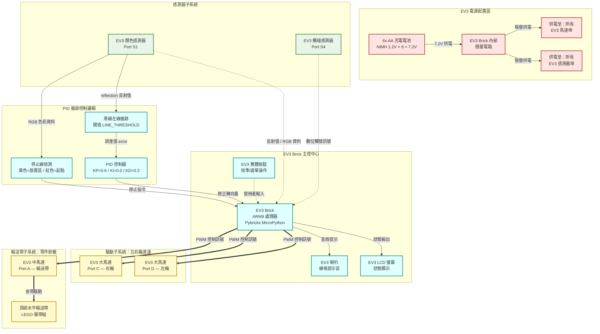

```mermaid
graph TD
    %% ================= 樣式設定 =================
    classDef power fill:#ffe4e1,stroke:#a52a2a,stroke-width:2px;
    classDef mcu fill:#e0ffff,stroke:#008b8b,stroke-width:2px;
    classDef motor fill:#fffacd,stroke:#b8860b,stroke-width:2px;
    classDef sensor fill:#e8f5e9,stroke:#2e7d32,stroke-width:2px;
    classDef note fill:#fcfcfa,stroke:#333,stroke-dasharray: 5 5,stroke-width:2px;

    %% ================= 電源系統 =================
    subgraph Power [EV3 電源配置區]
        BATT[6x AA 充電電池<br>NiMH 1.2V × 6 = 7.2V]
        BATT -->|7.2V 供電| EV3_PWR[EV3 Brick 內部<br>穩壓電路]
        EV3_PWR -->|穩壓供電| MOTOR_PWR[供電至：所有<br>EV3 馬達埠]
        EV3_PWR -->|穩壓供電| SENSOR_PWR[供電至：所有<br>EV3 感測器埠]
    end

    %% ================= 主控系統 =================
    subgraph Master [EV3 Brick 主控中心]
        EV3_BRICK[EV3 Brick<br>ARM9 處理器<br>Pybricks MicroPython]
        EV3_SCREEN[EV3 LCD 螢幕<br>狀態顯示]
        EV3_BTN[EV3 實體按鈕<br>校準/選單操作]
        EV3_SPK[EV3 喇叭<br>蜂鳴提示音]
        
        EV3_BTN -.->|使用者輸入| EV3_BRICK
        EV3_BRICK -->|狀態輸出| EV3_SCREEN
        EV3_BRICK -->|音效提示| EV3_SPK
    end

    %% ================= 感測器子系統 =================
    subgraph Sensors [感測器子系統]
        COLOR[EV3 顏色感測器<br>Port S1]
        TOUCH[EV3 觸碰感測器<br>Port S4]

        COLOR -.->|反射值 / RGB 資料| EV3_BRICK
        TOUCH -.->|數位觸發訊號| EV3_BRICK
    end

    %% ================= 驅動子系統 =================
    subgraph Drive [驅動子系統：左右輪差速]
        EV3_BRICK ==>|PWM 控制訊號| M_LEFT[EV3 大馬達<br>Port D — 左輪]
        EV3_BRICK ==>|PWM 控制訊號| M_RIGHT[EV3 大馬達<br>Port C — 右輪]
    end

    %% ================= 輸送帶子系統 =================
    subgraph Conveyor [輸送帶子系統：零件卸載]
        EV3_BRICK ==>|PWM 控制訊號| M_CONV[EV3 中馬達<br>Port A — 輸送帶]
        M_CONV ==>|皮帶驅動| BELT[頂部水平輸送帶<br>LEGO 履帶組]
    end

    %% ================= PID 控制邏輯 =================
    subgraph PID [PID 循跡控制邏輯]
        PID_CTRL[PID 控制器<br>KP=0.6 / KI=0.0 / KD=0.3]
        LINE_DET[黑線左緣循跡<br>閾值 LINE_THRESHOLD]
        COLOR_DET[停止線偵測<br>黃色=放置區 / 紅色=起點]

        COLOR -->|reflection 反射值| LINE_DET
        LINE_DET -->|誤差值 error| PID_CTRL
        PID_CTRL -->|修正轉向量| EV3_BRICK

        COLOR -->|RGB 色彩資料| COLOR_DET
        COLOR_DET -->|停止指令| EV3_BRICK
    end

    %% ================= 套用樣式 =================
    class BATT,EV3_PWR,MOTOR_PWR,SENSOR_PWR power;
    class EV3_BRICK,EV3_SCREEN,EV3_BTN,EV3_SPK,PID_CTRL,LINE_DET,COLOR_DET mcu;
    class M_LEFT,M_RIGHT,M_CONV,BELT motor;
    class COLOR,TOUCH sensor;
```
