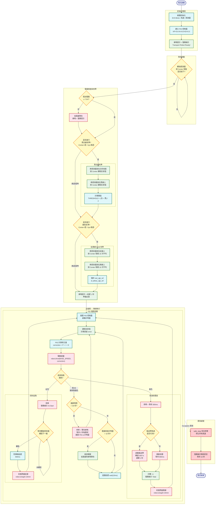

```mermaid
flowchart TD
    %% ================= 樣式設定 =================
    classDef startEnd fill:#e8eaf6,stroke:#283593,stroke-width:2px,color:#1a237e;
    classDef process fill:#e0f7fa,stroke:#00695c,stroke-width:2px;
    classDef decision fill:#fff9c4,stroke:#f57f17,stroke-width:2px;
    classDef action fill:#fce4ec,stroke:#c62828,stroke-width:2px;
    classDef io fill:#e8f5e9,stroke:#2e7d32,stroke-width:2px;
    classDef error fill:#ffcdd2,stroke:#b71c1c,stroke-width:2px;

    %% ================= 程式啟動 =================
    START([程式啟動]):::startEnd --> INIT

    subgraph INIT_BLOCK [初始化階段]
        INIT[硬體初始化<br>EV3 Brick / 馬達 / 感測器]:::process
        INIT --> PID_INIT[建立 PID 控制器<br>KP=0.6  KI=0.0  KD=0.3]:::process
        PID_INIT --> BEEP_READY[蜂鳴提示 + 螢幕顯示<br>Transport Robot Ready!]:::io
    end

    BEEP_READY --> WAIT_START

    %% ================= 等待啟動 =================
    subgraph START_BLOCK [等待啟動]
        WAIT_START{觸碰感測器<br>或 Center 按鈕<br>是否按下?}:::decision
        WAIT_START -- 否 --> WAIT_START
    end

    WAIT_START -- 是 --> BATT_INIT

    %% ================= 電量與校準 =================
    subgraph CAL_BLOCK [電量檢查與校準]
        BATT_INIT{電池電壓<br>≥ 7.0V?}:::decision
        BATT_INIT -- 否 --> LOW_BATT[低電量警告<br>蜂鳴 + 螢幕提示]:::action
        LOW_BATT --> CAL_ASK
        BATT_INIT -- 是 --> CAL_ASK

        CAL_ASK{是否進行<br>黑白線校準?<br>Center=是 / Up=跳過}:::decision
        CAL_ASK -- 是 --> CAL_BW
        CAL_ASK -- 跳過/超時 --> COLOR_ASK

        subgraph CAL_BW_BLOCK [黑白線校準]
            CAL_BW[將感測器放在白色地面<br>按 Center 讀取反射值]:::io
            CAL_BW --> CAL_BK[將感測器放在黑線上<br>按 Center 讀取反射值]:::io
            CAL_BK --> CAL_CALC["計算閾值<br>THRESHOLD = (白 + 黑) / 2"]:::process
        end
        CAL_CALC --> COLOR_ASK

        COLOR_ASK{是否進行<br>顏色校準?<br>Center=是 / Up=跳過}:::decision
        COLOR_ASK -- 是 --> COLOR_CAL
        COLOR_ASK -- 跳過/超時 --> READY_GO

        subgraph COLOR_CAL_BLOCK [紅黃線 RGB 校準]
            COLOR_CAL[將感測器放在紅線上<br>按 Center 取樣 10 次平均]:::io
            COLOR_CAL --> COLOR_Y[將感測器放在黃線上<br>按 Center 取樣 10 次平均]:::io
            COLOR_Y --> COLOR_DONE[儲存 red_rgb_ref<br>& yellow_rgb_ref]:::process
        end
        COLOR_DONE --> READY_GO

        READY_GO[蜂鳴提示 + 延遲 1 秒<br>準備出發]:::io
    end

    READY_GO --> MAIN_LOOP

    %% ================= 主循環 =================
    subgraph MAIN_BLOCK [主循環 — 無限執行]
        MAIN_LOOP[重置 PID 控制器<br>啟動計時器]:::process
        MAIN_LOOP --> FOLLOW

        subgraph FOLLOW_BLOCK [PID 循跡迴圈]
            FOLLOW[讀取反射值<br>計算誤差 error]:::io
            FOLLOW --> PID_COMPUTE["PID 計算修正量<br>correction = P + I + D"]:::process
            PID_COMPUTE --> DRIVE["驅動底盤<br>robot.drive(BASE_SPEED,<br>correction)"]:::action

            DRIVE --> CHECK_COLOR{檢測地面<br>顏色?}:::decision

            CHECK_COLOR -- 黃色 --> YELLOW_PROC
            CHECK_COLOR -- 紅色 --> RED_PROC
            CHECK_COLOR -- 黑/白<br>無特殊顏色 --> TIMEOUT_CHECK

            %% ---- 黃色停止線處理 ----
            subgraph YELLOW_BLOCK [到達放置區]
                YELLOW_PROC[停車 + 等待 300ms]:::action
                YELLOW_PROC --> PLACE_PARTS{輸送帶馬達<br>是否可用?}:::decision
                PLACE_PARTS -- 是 --> CONV_RUN["啟動輸送帶<br>轉速 300°/s<br>運轉 3 秒"]:::action
                PLACE_PARTS -- 否 --> CONV_SKIP[模擬放置<br>等待 800ms]:::action
                CONV_RUN --> ZONE_COUNT["計數 +1<br>螢幕顯示 Total"]:::io
                CONV_SKIP --> ZONE_COUNT
                ZONE_COUNT --> CROSS_Y["前進跨越黃線<br>robot.straight 10mm"]:::action
            end
            CROSS_Y --> MAIN_LOOP

            %% ---- 紅色停止線處理 ----
            subgraph RED_BLOCK [回到起點]
                RED_PROC[停車<br>螢幕顯示 At Start]:::action
                RED_PROC --> WAIT_TOUCH{等待觸碰感測器<br>觸發下一輪}:::decision
                WAIT_TOUCH -- 未觸發 --> WAIT_TOUCH
                WAIT_TOUCH -- 觸發 --> DEBOUNCE[防彈跳延遲<br>500ms]:::process
                DEBOUNCE --> CROSS_R["前進跨越紅線<br>robot.straight 10mm"]:::action
            end
            CROSS_R --> MAIN_LOOP

            %% ---- 逾時與電量檢查 ----
            TIMEOUT_CHECK{循跡時間<br>> 30 秒?}:::decision
            TIMEOUT_CHECK -- 是 --> TIMEOUT_ACT[停車 + 警告蜂鳴<br>等待 2 秒後重試<br>重置 PID & 計時器]:::action
            TIMEOUT_ACT --> FOLLOW
            TIMEOUT_CHECK -- 否 --> BATT_CHECK{電量檢查計時器<br>> 10 秒?}:::decision
            BATT_CHECK -- 是 --> BATT_WARN[檢測電壓<br>低電量則蜂鳴警告]:::io
            BATT_WARN --> LOOP_DELAY
            BATT_CHECK -- 否 --> LOOP_DELAY
            LOOP_DELAY["迴圈延遲 wait(10ms)"]:::process --> FOLLOW
        end
    end

    %% ================= 異常處理 =================
    MAIN_BLOCK -. "Exception 異常" .-> ERROR_HANDLER
    subgraph ERROR_BLOCK [異常處理]
        ERROR_HANDLER[safe_stop 安全停車<br>停止所有馬達]:::error
        ERROR_HANDLER --> ERROR_SHOW[螢幕顯示錯誤訊息<br>等待 10 秒]:::error
    end
    ERROR_SHOW --> PROG_END([程式結束]):::startEnd
```
