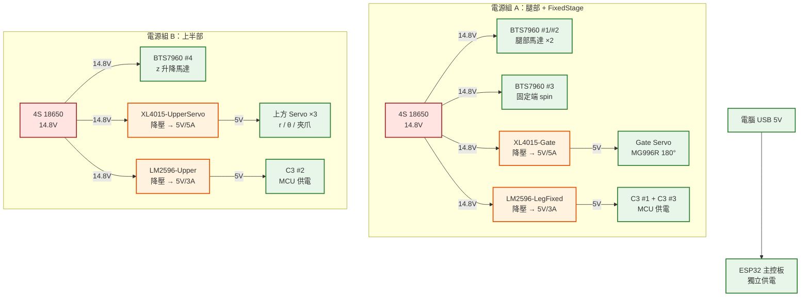

```mermaid
graph TD
    %% ================= 樣式設定 =================
    classDef battery fill:#ffe4e1,stroke:#a52a2a,stroke-width:2px;
    classDef buck fill:#fff3e0,stroke:#e65100,stroke-width:2px;
    classDef load fill:#e8f5e9,stroke:#2e7d32,stroke-width:2px;

    %% ================= 電源組 A：腿部 + FixedStage =================
    subgraph GroupA ["電源組 A：腿部 + FixedStage"]
        BATT_A["4S 18650<br>14.8V"]

        BATT_A -->|14.8V| BTS12["BTS7960 #1/#2<br>腿部馬達 ×2"]
        BATT_A -->|14.8V| BTS3["BTS7960 #3<br>固定端 spin"]
        BATT_A -->|14.8V| XL_GATE["XL4015-Gate<br>降壓 → 5V/5A"]
        BATT_A -->|14.8V| LM_LF["LM2596-LegFixed<br>降壓 → 5V/3A"]

        XL_GATE -->|5V| GATE_SRV["Gate Servo<br>MG996R 180°"]
        LM_LF -->|5V| C3_13["C3 #1 + C3 #3<br>MCU 供電"]
    end

    %% ================= 電源組 B：上半部 =================
    subgraph GroupB ["電源組 B：上半部"]
        BATT_B["4S 18650<br>14.8V"]

        BATT_B -->|14.8V| BTS4["BTS7960 #4<br>z 升降馬達"]
        BATT_B -->|14.8V| XL_UPPER["XL4015-UpperServo<br>降壓 → 5V/5A"]
        BATT_B -->|14.8V| LM_UP["LM2596-Upper<br>降壓 → 5V/3A"]

        XL_UPPER -->|5V| SRV3["上方 Servo ×3<br>r / θ / 夾爪"]
        LM_UP -->|5V| C3_2["C3 #2<br>MCU 供電"]
    end

    %% ================= 主控板獨立供電 =================
    USB["電腦 USB 5V"] --> ESP32["ESP32 主控板<br>獨立供電"]

    %% ================= 套用樣式 =================
    class BATT_A,BATT_B battery;
    class XL_GATE,XL_UPPER,LM_LF,LM_UP buck;
    class BTS12,BTS3,BTS4,GATE_SRV,SRV3,C3_13,C3_2,ESP32,USB load;
```
