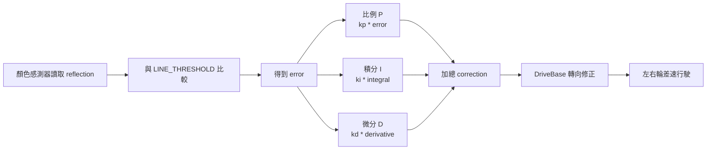

# EV3 運輸機器人操控方塊圖邏輯

本圖對應 `ev3_program/transport_robot.py` 的主控制流程，重點包含啟動、校準、PID 循跡、黃線放置、紅線回起點等待，以及逾時/低電量保護。

```mermaid
flowchart TD
    A([程式啟動]) --> B[初始化硬體<br>EV3 / 左右輪馬達 / 顏色感測器 / 觸碰感測器]
    B --> C[建立 PID 控制器<br>設定 KP、KI、KD、BASE_SPEED]
    C --> D[螢幕顯示 Ready<br>蜂鳴提示]

    D --> E{觸碰感測器<br>或 Center 鍵按下?}
    E -- 否 --> E
    E -- 是 --> F{電池電壓過低?}

    F -- 是 --> G[低電量警告<br>蜂鳴 + 螢幕提示]
    F -- 否 --> H
    G --> H{是否黑白線校準?}

    H -- Center --> I[讀取白地反射值<br>讀取黑線反射值]
    I --> J[計算 LINE_THRESHOLD<br>黑白中間值]
    H -- Up / 逾時 --> K
    J --> K{是否紅黃線校準?}

    K -- Center --> L[紅線 RGB 取樣平均<br>黃線 RGB 取樣平均]
    L --> M[儲存紅線/黃線參考值]
    K -- Up / 逾時 --> N
    M --> N[蜂鳴提示<br>延遲 1 秒後開始]

    N --> O[[主循環開始]]
    O --> P[重置 PID<br>重置單段循跡計時器]
    P --> Q[讀取顏色感測器反射值]
    Q --> R[計算誤差<br>error = reflection - LINE_THRESHOLD]
    R --> S[PID 計算轉向修正量]
    S --> T[DriveBase 行駛<br>robot.drive(BASE_SPEED, correction)]
    T --> U{偵測到停止線顏色?}

    U -- 無 / 黑白線 --> V{單段循跡超過 30 秒?}
    V -- 是 --> W[停車 + 警告蜂鳴<br>等待 2 秒<br>重置 PID 與計時器]
    W --> Q
    V -- 否 --> X{距上次電量檢查<br>超過 10 秒?}
    X -- 是 --> Y[檢查電量<br>低電量則警告]
    X -- 否 --> Z[等待 10 ms]
    Y --> Z
    Z --> Q

    U -- 黃線 --> AA[停車<br>等待 300 ms]
    AA --> AB{輸送帶馬達可用?}
    AB -- 是 --> AC[啟動輸送帶<br>運轉 3 秒後停止]
    AB -- 否 --> AD[等待 800 ms<br>模擬放置]
    AC --> AE[放置區計數 +1<br>螢幕顯示總數]
    AD --> AE
    AE --> AF[前進 10 mm<br>跨越黃線避免重複偵測]
    AF --> O

    U -- 紅線 --> BA[停車<br>顯示 At Start]
    BA --> BB{觸碰感測器<br>再次按下?}
    BB -- 否 --> BB
    BB -- 是 --> BC[防彈跳等待 500 ms]
    BC --> BD[前進 10 mm<br>跨越紅線]
    BD --> O

    A -. 發生例外 .-> EA[安全停車 safe_stop<br>停止底盤與輸送帶]
    EA --> EB[螢幕顯示錯誤訊息<br>等待 10 秒]
    EB --> EC([程式結束])
```

## 核心判斷邏輯

| 方塊 | 程式對應 | 功能 |
|---|---|---|
| 等待啟動 | `main()` 啟動等待迴圈 | 等待觸碰感測器或 EV3 Center 鍵 |
| 黑白線校準 | `calibrate_sensors()` | 讀白地與黑線反射值，更新循跡閾值 |
| 紅黃線校準 | `calibrate_colors()` | 取紅線/黃線 RGB 平均值，用於停止線判斷 |
| PID 循跡 | `read_line_position()`、`pid.compute()`、`follow_line()` | 依反射值誤差修正轉向 |
| 黃線處理 | `stop_color == Color.YELLOW` | 停車、放置零件、計數、跨越黃線 |
| 紅線處理 | `stop_color == Color.RED` | 停車等待下一輪，再跨越紅線 |
| 安全保護 | `LINE_FOLLOW_TIMEOUT`、`check_battery()`、`safe_stop()` | 防止脫軌、低電量提醒、例外停車 |

## PID 循跡子邏輯



